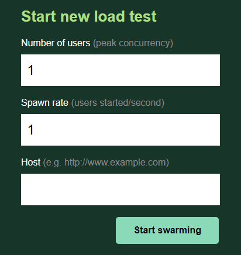
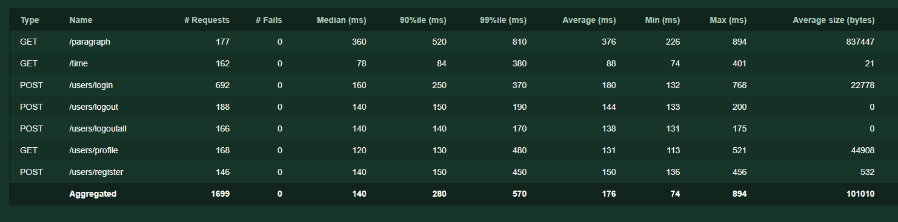

# Locust Load Test

##  Prerequisites
### Load Test 
- Python 3.x.x
- Locust (Load Test)
- Faker (Fake Data)

### Backend
- NodeJs
  - Express (Backend)
  - mongoose (mongodb connection)
  - jsonwebtoken (jwt generate)
  - dotenv (env. variable)
  - lorem-ipsum (random paragraph)
- Heroku (Backend Deploy)
- MongoDb (Database)


## Installing
1. Install &nbsp;[python 3.x.x](https://www.python.org/downloads/)


2. In command prompt install python libraries
    ```
   pip install locust
   pip install faker
    ```

3. Create a Node project for backend
    ```
    npm init <backend>
    ```

4. In command prompt install node modules
    ```
    cd <backend>
    npm install express
    npm install jsonwebtoken
    npm install mongoose
    npm install dotenv
    npm install heroku
    ```

5. Create MongoDb cluster and put MongoDb connection url in .env file under backend folder
    ```
    MONGODB_URL=<MONGODB_URL>
    JWT_KEY=<JWT_KEY>
    PORT=8080
    ```
  

6. Create &nbsp;[Heroku](https://www.heroku.com/) &nbsp;App;


7. In command prompt
    ```
   cd <backend>
   heroku login   #browser will be appear login to your heroku account
   heroku git:remote -a <heroku-app-name>
   git add .
   git commit -am "initial commit"
   git push heroku master    
    ```


## Backend

### Open Endpoints
  Open endpoints require no Authentication.
  * [Register]() : `POST /users/register/`
  * [Login]() : `POST /users/login/`
  * [Time]() : `GET /time/`
  * [Paragraph](): `GET /paragraph/`

### Endpoints that require Authentication
Closed endpoints require a valid Token to be included in the header of the
request.

  * [Profile]() : `GET /users/profile/`
  * [Logout]() : `POST /users/logout/`
  * [Logout All](): `POST /users/logoutall/`


## Usage

### Start with web interface

1. In command prompt
    ```
   cd <project_folder_name>
   locust -f <load_test_file_name.py>    
    ```
   

2. After successfully build a web interface will be start at [localhost:8089](localhost:8089)


3. Go to &nbsp;[localhost:8089](localhost:8089)
    
    &nbsp;

    * [Number of users]() : Number of maximum user count
    * [Spawn rate]() : Number of users count to increase per second
    * [Host]() : API host address. In this project: `https://test-automation-sigortam-net.herokuapp.com`
    
    &nbsp;

    

 &nbsp;

### Start with conf file
1. Create a locust.conf file under project folder


2. Configure conf file
   ```
   locustfile = load_test.py
   host = https://test-automation-sigortam-net.herokuapp.com/
   users = 10
   spawn-rate = 10
   run-time = 1m
   autostart = true 
   ```
   
3. Start locust in terminal
   ```
   locust
   ```
4. Sample Output
    
    &nbsp;

    
    